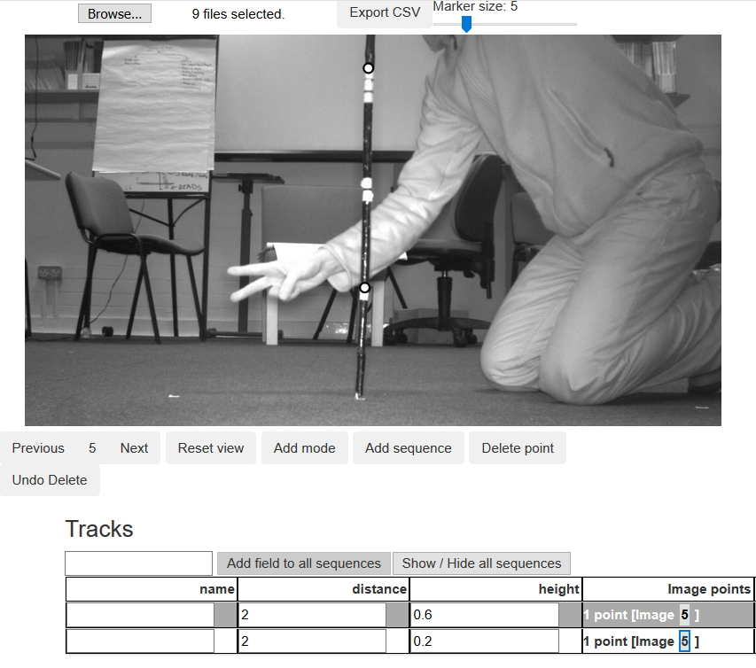
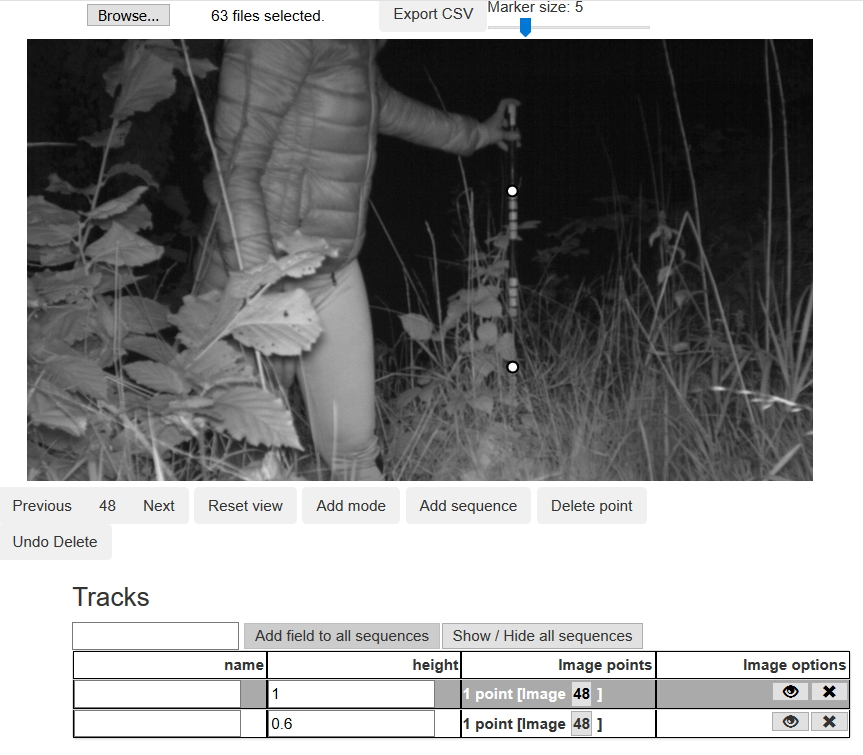

```{r setup, include=FALSE}
knitr::opts_chunk$set(echo = TRUE)
```

## Background
The random encounter model, distance sampling and related methods require data on animal positions relative to camera in order to estimate camera detection zone size and (for REM) animal speed of movement. This vignette sets out a process for generating animal position and speed data from camera trap images in order to apply either the REM or Distance sampling, using:  

1. Images of calibration objects to inform computer vision models;

2. The html tool **animaltracker** to digitise images (see <https://lauravzarco.github.io/animaltracker>);  

3. Work-in-progress R package **CTtracking** to fit calibration models and predict animal positions and speeds (see <https://github.com/MarcusRowcliffe/CTtracking>).


## 1. Making calibration images

### Camera calibration
The goal is to take pictures of objects of known size at a range of known distances from the camera in order to calculate the camera's intrinsic properties, which then allow us to calculate the positions of objects of known size, as used in site calibration. This needs to be done for each combination of camera model and image resolution setting used in the field (Note: it's best to keep image resolution consistent throughout; if you do this, and use a consistent camera model, you only need to calibrate one camera). The steps are as follows:

1. Make a calibration pole, with regular length intervals clearly marked. A 1 m pole with 20 cm intervals marked works well (Fig. 1). Note that the gradations on this pole are indicated by the number of bands, so for example, the top of the triple band is at 60 cm from the tip, whereas the single band is at 20 cm. 

2. On an open arena, mark out nine or more positions at a range of different radial and angular distances from the camera, measuring the distances from camera accurately. Fig. 2 gives an example of placement positions, with poles at three distances (1, 2 and 4 m), and a range of angles. It's not necessary to measure angle, but it should be variable, and within the camera's field of view (usually about 20 degrees either side of the mid line, but you may need to check the effective field of view for your camera and setting).

3. With a camera positioned in front of the arena and switched on, take one image of the pole at each position on the array, holding up some visible marker of the distance. For example, in Fig. 1, the pole is placed at 2 m from the camera, with distance indicated in metres by the number of fingers displayed. 


```{r echo=FALSE, fig.cap="Fig. 1. Animaltracker screenshot of a camera calibration image with pole in position 2 m from the camera, and two postions digitised at given heights.", out.width="60%", fig.align="center"}

```


```{r echo=FALSE, fig.cap="Fig. 2. Diagram of an example layout for a camera calibration pole grid.", out.width="60%", fig.align="center"}
th <- c(70, 90, 110)*pi/180
rr <- c(1,2,4)
dat <- expand.grid(rr,th)
sq <- seq(60, 120, len=100)*pi/180
par(mar=c(0,0,2,0))
plot(c(0,4), c(-2.4,2.4), xaxt="n", yaxt="n", xlab="", ylab="", type="n", asp=1)
for(r in rr){
  x <- r*sin(sq)
  y <- r*cos(sq)
  lines(x, y, col="navyblue", lty=2)
  text(x[1], y[1], paste(r, "m"), pos=3, col="navyblue")
}
points(dat$Var1*sin(dat$Var2), dat$Var1*cos(dat$Var2), pch=16)
lines(c(0, 4.2*sin(62*pi/180)), c(0, 4.2*cos(62*pi/180)))
lines(c(0, 4.2*sin(118*pi/180)), c(0, 4.2*cos(118*pi/180)))
points(0,0,pch=15, col="darkred", cex=2)
text(0,0,"Camera", pos=2, col="darkred")
```

### Deployment calibration
The goal is to take images of calibration poles in the field, as above but without having to measure distance. Using the same calibration pole as above, carry out the following procedure at each camera deployment, either when setting, checking or removing the camera. Note that if the camera is changed or moved, even slightly, the calibration process should be repeated for that deployment.

1. With the camera in its final operating position, arm the camera.

2.	Starting about 1m directly in front of the camera, hold the pole vertically with its base on the ground so that it is clearly visible by the camera, and held still long enough to ensure a clear image (generally a few seconds). Fig. 3 shows an example of a resulting image.

3.	Repeat this for further pole placements across the field of view and away from the camera with placements spaced about 1 m apart. Continue away from the camera to the maximum extent that any animals are likely to be captured, or if possible a bit beyond. As you reach greater distances, it may help to have a second person next to the camera to keep it triggering. Aim for 10-20 placements, perhaps more if visibility is very good Fig. 4 shows an example configuration of deployment calibration pole placements.


```{r echo=FALSE, fig.cap="Fig. 3. Animal tracker screenshot of a deployment calibration image with two pole positions digitised at given heights.", out.width="60%", fig.align="center"}

```


```{r echo=FALSE, fig.cap="Fig. 4. Diagram of an example set of pole locations for a deployment calibration. Note this can be set out without measuring anything.", out.width="60%", fig.align="center"}
th <- c(70, 90, 110)*pi/180
rr <- seq(0.5, 3.5, 0.5)
dat <- expand.grid(rr,th)
thjit <- 0.06
rjit <- 0.07
par(mar=c(0,0,2,0))
plot(c(-1,4), c(-2.4,2.4), xaxt="n", yaxt="n", xlab="", ylab="", type="n", asp=1)
points(dat$Var1*runif(nrow(dat),1-rjit,1+rjit)*sin(dat$Var2+runif(nrow(dat),-thjit,thjit)), 
       dat$Var1*runif(nrow(dat),1-rjit,1+rjit)*cos(dat$Var2+runif(nrow(dat),-thjit,thjit)), pch=16)
lines(c(0, 4*sin(62*pi/180)), c(0, 4*cos(62*pi/180)))
lines(c(0, 4*sin(118*pi/180)), c(0, 4*cos(118*pi/180)))
points(0,0,pch=15, col="darkred", cex=2)
text(0,0,"Camera", pos=2, col="darkred")
```


## 2. Digitising images

### Animaltracker basics
1. Organise images into folders specific to the deployment (for animal and deployment calibration images) or camera (for camera calibration images), naming folders with identifiers unique to the deployment or camera type as appropriate. Deployment calibration and animal images can be left in the same folders, but keep the camera and deployment image sets on separate paths.

2. Open animal tracker: <https://lauravzarco.github.io/animaltracker>

3. Click *Browse* -> navigate to your chosen image directory -> select all images (*Ctrl+a*) -> OK

4. Digitise points:
  * Scroll through images using Next / Previous buttons or cursor keys to find those you want to digitise.
  * To digitise a point or sequence: click *Add sequence* and click on the desired point on each image until the sequence ends. Note that it is not possible to digitise a multi-point sequence on a single image.
  * Once you have digitised a point, a data table will appear. Use the default *name* field to tag species, and add any additional fields by typing the field name into the box above the table and clicking *Add field to all sequences*.
  * If you want to delete or move a point, scroll back to the image on which the point was digitised (you'll see it highlighted when viewing the correct image) and click *Add mode*, then click and drag the point to move it, or click *Delete point* to delete. Once finished, click *Edit mode* to go back and continue digitising.
  * To show or hide a sequence, click on its 'eye' icon; to delete a sequence, click on its 'x' icon.
  * Use the mouse scroll wheel to zoom the image, or click and drag to move it. The *Reset view* button returns the image to full screen.

5. When finished digitising a set of images, click *Export CSV* -> *Open* -> *OK* -> save the resulting file to the folder containing the images you have just been digitising (saving to this folder is essential for subsequent processing). If you need to take a break and shut down before completing a set of images, make a note of the last image digitised. Then, when re-starting, you can open images from that point for the next session, export the csv file as above when ready, and cut and paste the resulting data into the partially completed csv file created earlier.

6. To start a new image directory, refresh your browser and repeat from step 3.

### Camera calibration

For each pole, digitise two points a known height above ground, each as a new single-point sequence, and for each recording: distance from camera in metres, in a new field called "distance"; and height of digitised point in metres, in a new field called "height". See Fig. 1 for an example.
  
### Deployment calibration

For each pole seen to be in position resting on the ground, digitise the upper- and lower-most visible reference points, each as a new single-point sequence. For each point, record the height of the point in metres in a new field called "height". See Fig. 3 for an example.

### Animal sequences

1. Digitise animal positions at points on the ground directly beneath the animals' centre of mass, as best you can judge.

2. If the animal is only partially visible, digitise the position on the canvas outside the image itself. To do this, you may need to move or zoom the image to make space on the canvas (see Fig. 5 left panel).

3. At least the first position of every individual animal passing should be digitised. Subsequent positions of the same individual should be digitised as part of the same sequence (i.e. without pressing the *Add sequence* button, see Fig. 5 right panel), but it may be sensible to finish a sequence  before the animal has entirely disappeared if it has moved a long way from the camera (particularly if it moves well beyond the calibrated area).

4. During digitisation, look out for moments at which the camera clearly changes its orientation. It may be necessary to truncate the deployment at that time, as positions for any points digitised after that cannot be accurately estimated unless there has been a subsequent set of calibration images taken that apply to that period. If you know there have been no recalibration images taken, there is no need to digitise any further animal positions. If on the other hand there has been a subsequent set of calibration images taken, you will need to create a new deployment, separating the images into separate folders and creating separate digitisation data files.


```{r echo=FALSE, fig.cap="Fig. 5. Animaltracker screenshots, showing the first (left) and second (right) images of a sequence. The animal (red fox) is initially only partially visible, and the image is zoomed out and shifted to find the animal's approximate position. In the second image, the animal is fully within the frame and the image has been resized positioned accordingly", out.width="100%", fig.align="center"}
pth <- "animaltracker_animal_screenshots.jpg"
knitr::include_graphics(pth)
```


## 3. Generating position and speed data

The CTtracking package is under development and not (yet) available on CRAN. You can download the code file CTtracking.r from <https://github.com/MarcusRowcliffe/CTtracking>, and load it using:
```{r eval=FALSE}
source("CTtracking.r")
```
Or you can load it directly from Github like this:
```{r message=FALSE}
devtools::source_url("https://raw.githubusercontent.com/MarcusRowcliffe/CTtracking/master/CTtracking.r")
```

### Extraction image exif data (metadata)
A core processing step is to inspect and extract relevant metadata from images. Functions for this use the exiftool utility available at (<https://exiftool.org/>). This must be installed as a one-off (or occasional update). The easiest way to install is to run:
```{r eval=FALSE}
install.exiftool()
```
This places the exiftool in the current R library, which is also where subsequent exif function calls expect to find it. If this automatic install doesn't work, you can install manually. Download ExifTool from the website, unzip it, rename the exiftool(-k).exe file to exiftool.exe, and place it in a relevant folder. If this is not the current R library, you will need to specify the path in calls to exif functions.


### Fitting camera calibration models
This step is necessary if deployment calibration images are collected without distance measurements. A camera calibration model is needed for each type of camera, where type is defined by the combination of camera parameters and image resolution setting. In practice, camera parameters may vary between makes, but are likely to be consistent across minor model variations within makes (although this may be worth checking). The steps to fit camera calibration models are:

1. Create a dataframe of metadata from the digitised camera calibration images using the CTtracking function `read.exif`. In this example, the all images and data are contained in folder called Survey_yyy within the working directory, and camera digitisation data are contained in a subfolder named "Cameras":
```{r message=FALSE}
folder <- "./Survey_yyy"
campth <- file.path(folder, "Cameras")
cam.exdat <- read.exif(campth)
```

2. Create a dataframe of camera digitisation data, pooling across camera-specific files. This is a two-step process, first using `read.digidat` to read digitisation csv files and add necessary fields from image metadata, and then using using `pairup` to create a dataframe with one row per pair of digitised points from a single pole, rather than one row per point. The `read.digidat` function requires a path to the folder containing the digitisation csv images, followed by the exif data frame. The `pair` argument in the `pairup(...)` call indicates the field name or combination of field names that identifies the pairs of points from a single pole. In this case, because each pole was digitised in a unique image, and images for each camera were stored in a separate folder, the combination of folder and image name is diagnostic:
```{r}
camdat <- read.digidat(campth, cam.exdat)
camdat <- pairup(camdat, pair=c("folder", "image_name"))
```

3. Fit the camera calibration models using `cal.cam`. This requires the digitisation data frame created above. Additionally, if the input contains data for more than one camera, a second argument is required, giving the name of a field in the data frame that uniquely identifies cameras. In this case, the folder field is diagnostic:

```{r}
cmods <- cal.cam(camdat, "folder")
```

4. Check model fit before proceeding, by plotting the resulting models. Two plots are created for each camera:
  * A plot of length (m) per pixel as a function of distance from camera, with points shaded by distance from the image centre, and fitted lines for the edge and centre of the image. 
  * A plot of poles as they appeared on the image according to the data supplied, with shading coded by distance.

Any clearly out of place points or poles may indicate a digitising or pole placement problem that needs fixing. In this case the fit looks good.

```{r eval=FALSE}
plot(cmods)
```

```{r echo=FALSE, fig.cap="Fig. 6. Diagnostic plots for a camera calibration model", fig.align="center"}
par(mfrow=c(1,2))
plot(cmods[[1]])
```


### Fitting deployment calibration models
The steps required are essentially the same as those for camera calibration above:

1. Create a dataframe of metadata from the deployment calibration and animal images. This uses `read.exif` again, but will take some time if you're processing a large image collection, so you may want to go and get a cup of tea, then save the resulting dataframe for re-loading in subsequent sessions, rather than having to re-run metadata extraction. You can also make things a bit more efficient by extracting only the metadata fields you'll need. The default fields (Directory, FileName, DateTimeOriginal, ImageWidth and ImageHeight) are sufficient for all processing outlined here. To check that this makes sense before a full extraction, you can use the `peep.exif` function to check the metadata of one image within a given folder:
```{r eval=FALSE}
deppth <- file.path(folder, "Deployments")
View(peep.exif(deppth))
```
```{r echo=FALSE}
deppth <- file.path(folder, "Deployments")
peep <- head(peep.exif(deppth))
peep$Value <- strtrim(peep$Value, 29)
peep
```

Full inspection in this case reveals that the default fields are as expected, so we can leave the fields argument as default. However, our metadata also contain a field of tags that were added during initial image tagging to identify species. Because these tags are initially combined into a single field, and we wish them to become separate fields in the output, we need to use the tagfield argument to specify the name of the metadata field containing tags - usually this field name will be "Keywords". To distinguish tags and their values within the Keywords field, consistent separators are required. The default separators used by `read.exif` match the  hierarchical tags added in the free image management app XnView (<https://www.xnview.com>). For example, a Keywords value `count|1, species|bear` indicates tags for a single bear, where ", " is the tag separator, and "|" is the value separator. If you have used different separators you can define them in the call to `read.exif` through `tagsep` and `valsep` arguments (see also the `split.tags` function, which actually does the splitting). In this case, we can use the default settings:
```{r eval=FALSE}
##Do this the first time
dep.exdat <- read.exif(deppth, tagfield="Keywords")
write.csv(dep.exdat, file.path(folder, "exifdata.csv"), row.names = FALSE)
```
```{r}
##In subsequent sessions you can just run this
dep.exdat <- read.csv(file.path(folder, "exifdata.csv"), 
                      stringsAsFactors = FALSE)
```

2. Create a dataframe of deployment digitisation data, pooling across csv files from multiple deployments. First, run `read.digidat`, specifying a path to the folder containing all images, and the metadata data frame created above. This will extract from all images, both calibration and animal, so in a subsequent step, filter out only calibration images, and feed these into the `pairup` function as for camera calibration images:
```{r warning=FALSE, results=FALSE, message=FALSE}
depdat <- read.digidat(deppth, exifdat=dep.exdat)
caldat <- pairup(subset(depdat, species=="calibration"), 
                 pairtag=c("folder", "image_name"))
```
The call to `read.digidat` may throw a warning that flags up some problematic poles (e.g. only one, or more than two points apparently digitised on a single pole). You may want go back and check for errors in the digitisation and fix these before proceeding.

3. Fit deployment calibration models using `cal.dep`. To do this, you first need to create a deployment table, specifying which camera (as named in the camera calibration models) was used at each deployment. The fields in the example below, are:
  * `station`, indicating the camera location for the purposes of sample attribution in later analysis;
  * `deployment`, indicating camera deployment for the purposes of calibration (usually the same as station but can diverge, for example if a new camera is deployed at a given station part way through a survey);
  * `start` and `stop`, the dates and times at which deployment began and ended (needed for later analysis, although not used here);
  * `camera`, the name of the camera or camera type used for each deployment (these must match with the names of camera models created above).
```{r warning=FALSE, message=FALSE}
(deptab <- read.csv(file.path(folder, "deptable.csv")))
```
As well as this table matching cameras to deployments, the call to `cal.dep` requires two inputs from above, the deployment calibration data frame, and the camera calibration models, as well as a `deptag` argument indicating which field in the data frame defines deployments. This may throw warnings if some models could not be fitted (e.g. because fewer than the minimum number of poles were digitised):
```{r warning=FALSE, message=FALSE}
dmods <- cal.dep(caldat, cmods=cmods, deptag="deployment", lookup=deptab)
```

4. Check model fit before proceeding by making diagnostic plots for the resulting models. Two plots are created for each deployment:
  * A plot of distance from camera as a function of y pixel position, with points shaded by x pixel position, and fitted lines at the edges and centre of the image.
  * A plot of poles as they appeared on the image according to the data supplied, with shading coded by distance and digitised points indicated in red.
Any clearly out of place points or poles may indicate a digitising problem that needs fixing. In the figure below, deployment S01 has fewer poles on the left hand side of the image than we'd like, but is likely still an adequate model given the relatively flat terrain:

```{r eval=FALSE}
plot(dmods)
```
```{r echo=FALSE, fig.cap="Fig. 7. Diagnostic plots for a deployment calibration model", fig.align="center"}
par(mfrow=c(1,2))
plot(dmods$'S01')
```

### Generating animal position and speed data
1. Using the animal digitisation dataframe and deployment calibration models created above, add predicted radial and angular positions for each point to the dataframe using function `predict.pos`. If any records in the digitisation data come from deployments that do not have a matching deployment calibration model, these records will be stripped out with a warning.

```{r}
animdat <- subset(depdat, species!="calibration")
posdat <- predict.pos(animdat, dmods)
```
It is possible that radial distances for some records will have been poorly estimated, particularly where animals move beyond the deployment calibration grid, so it is worth exploring the distributions of distance and angle estimates, perhaps going back to the digitisations to check for problems (e.g. poorly placed points, substantial shifts in camera orientation during the deployment), and judiciously removing any remaining extreme observations from subsequent analyses.


2. Using the output of `predict.pos` call created in the last step, create a dataframe summarising sequences with distances travelled over given times and the resulting speed estimates.

```{r}
seqdat <- seq.summary(posdat)
```
